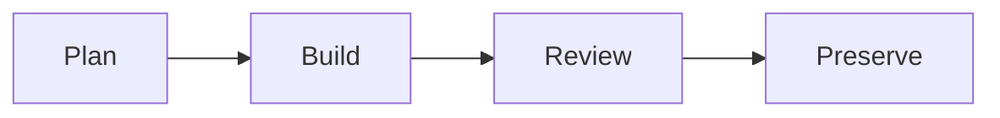

# Development Workflow

> Every PR that changes behavior must contribute knowledge. A PR without its feature context update is incomplete.

## The 4 Phases



| Phase | What | Output |
|-------|------|--------|
| **Plan** | Read architecture docs, search existing code, write a feature context file with overview, approach, and key files | `docs/feature-contexts/<date>-<type>-<slug>.md` |
| **Build** | Feature branch (`coamit/<type>/<slug>`), incremental commits, `make check` after each change | Passing CI |
| **Review** | Run the [refactoring checklist](../AGENTS.md#refactoring-checklist), create PR. PR must include the feature context file and a README.md entry. | Merged PR |
| **Preserve** | After merge, verify the feature context reflects what was actually built. Update [`docs/feature-contexts/README.md`](feature-contexts/README.md) with new architecture decisions or terminology. | Up-to-date domain knowledge |

## The Knowledge Rule

Every PR that changes behavior must include updates to `docs/feature-contexts/`:

1. **A feature context file** — `<YYYY-MM-DD>-<type>-<slug>.md` (type is `feature`, `bug`, or `refactor`)
2. **A README.md entry** — add a row to the Feature History table in `docs/feature-contexts/README.md`

Knowledge preservation is part of the definition of done, not an afterthought. The next developer (or AI agent) starting work in this area should never start from zero.

## When to Use Each Phase

| Scope | Plan | Build | Review | Preserve |
|-------|------|-------|--------|----------|
| Trivial (typo, config tweak) | Skip | Yes | Yes | Skip |
| Small (1-3 files, no new concepts) | Skip — write feature context directly in the PR | Yes | Yes | Yes |
| Medium+ (4+ files, new concepts) | Full plan — create feature context before coding | Yes | Yes | Yes |

## Feature Context File Template

Create in `docs/feature-contexts/<YYYY-MM-DD>-<type>-<slug>.md`:

```markdown
# <Feature Name>

## Overview
<2-3 sentences: what was built and why>

## Implementation Summary
<What was actually built — bullet list of key changes>

## Key Files
- `path/to/file.js` — what it does and why it was changed

## Key Decisions
| Decision | Reasoning |
|----------|-----------|
| <what was decided> | <why this approach over alternatives> |

## Gotchas
- <non-obvious behaviors, things that could break, edge cases discovered>
```

Omit sections that have no content. The goal is to capture decisions and gotchas that aren't obvious from reading the code — not to restate what the diff shows.

